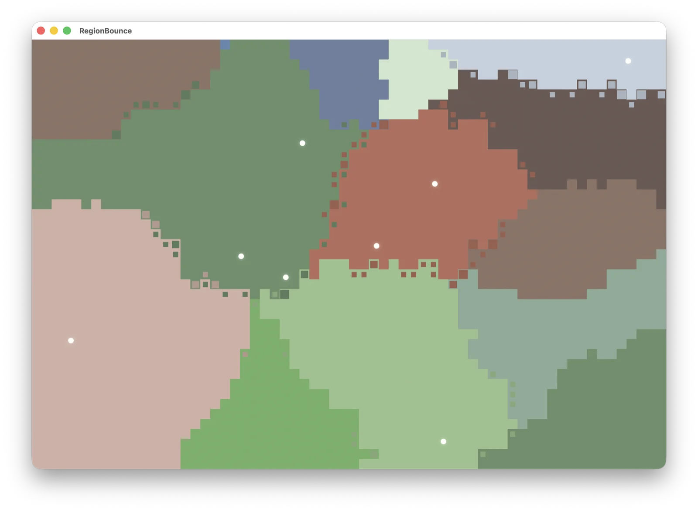

# RegionBounce

RegionBounce is a native macOS screen saver where moving balls reshape a pixel map of connected color territories. Every region starts with exactly one ball carrying that region's color. When a ball hits a foreign boundary, that square pixel immediately changes to the ball's color.

Every world starts from randomly placed seeds that grow into connected, irregular regions. The result is less like a random checkerboard and more like a tiny evolving map.



## Features

- Native universal `arm64` and `x86_64` `.saver` bundle
- Standalone preview app with **World → New World** (`⌘N`) and full-screen mode
- Connected random starting regions generated with randomized multi-source growth
- One ball per starting region and immediate single-pixel conversion on every boundary collision
- Equal-size square cells across the entire map, with edge pixels clipped rather than stretched
- Four palettes: Earth, Sorbet, Ocean, and Monochrome
- Screen saver settings for regions, grid size, speed, automatic reseeding, and ball visibility
- Deterministic, platform-independent C++ simulation with connectivity and lifecycle tests
- Silent operation, suitable for a screen saver

## Build

RegionBounce requires macOS 12 or newer, Xcode command-line tools, and CMake 3.21 or newer.

```sh
./scripts/build-release.sh
```

This builds and tests both bundles, ad-hoc signs them for local use, verifies their signatures, and creates `dist/RegionBounce-macOS.zip`.

To run the preview app:

```sh
open build-release/RegionBounce.app
```

To install the screen saver, open `build-release/RegionBounce.saver` in Finder or double-click it and let macOS add it to **System Settings → Screen Saver**. Local ad-hoc signing is intended for development; downloadable releases should be Developer ID signed and notarized.

## How it works

1. Random seed cells are assigned distinct region identities.
2. A randomized frontier grows each seed one neighboring cell at a time. Every resulting starting region is connected.
3. Exactly one ball spawns inside each completed region and carries that region's color.
4. A ball bounces when its leading edge encounters another region, immediately converting that one boundary pixel.
5. The map is drawn as equal-size squares. It slightly overscans and clips the top and bottom edge when the viewport's aspect ratio does not divide evenly.
6. The world is regenerated after the configured interval.

## Inspiration

The interaction is inspired by [Keef U's 2021 Bounceorama experiment](https://x.com/keef_u/status/1390274784882085889), which in turn credited [@jagarikin](https://x.com/jagarikin/status/1388660839205326851). RegionBounce is an independent native implementation with a connected-region generator and no source-code dependency on the web experiment.

## License

[MIT](LICENSE)
